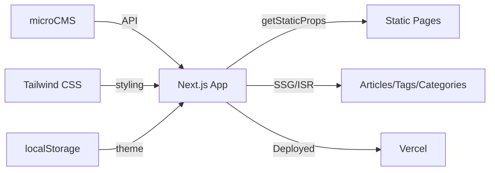

# nextjs-blog ステアリングドキュメント

## 1. プロジェクト概要

### 目的

Next.js + TypeScript + Tailwind CSS を活用したモダンなブログプラットフォームを構築する。microCMS を CMS バックエンドとして活用し、記事、カテゴリ、タグなどを管理可能な拡張性の高いブログシステムを提供する。

### 主要機能

- **記事管理**: microCMS 連携による記事の取得・表示
- **カテゴリ・タグ機能**: 記事の分類と検索機能
- **ダークモード対応**: localStorage を利用したテーマ切り替え
- **レスポンシブデザイン**: モバイル、タブレット、デスクトップに対応
- **プロフィール・プロジェクト表示**: 開発者情報とポートフォリオ機能
- **検索機能**: 記事検索 API エンドポイント
- **プレビュー機能**: Draft/Preview モードのサポート

---

## 2. 技術スタック

| カテゴリ               | 技術                             | バージョン                     | 用途                                    |
| ---------------------- | -------------------------------- | ------------------------------ | --------------------------------------- |
| 言語                   | TypeScript                       | 4.9.4                          | 型安全な開発                            |
| フレームワーク         | Next.js                          | ^16.0.10                       | React フレームワーク・SSG/SSR           |
| フロントエンド         | React                            | ^19.2.3                        | UI コンポーネント構築                   |
| スタイリング           | Tailwind CSS                     | ^3.2.4                         | ユーティリティベース CSS フレームワーク |
| CMS                    | microCMS                         | ^2.3.2                         | ヘッドレス CMS バックエンド             |
| マークアップ解析       | html-react-parser                | ^5.2.10                        | HTML を React コンポーネントに変換      |
| シンタックスハイライト | highlight.js                     | ^11.7.0                        | コードブロックのハイライト              |
| 日付操作               | dayjs                            | ^1.11.18                       | 日付フォーマット・操作                  |
| スタイルツール         | PostCSS                          | ^8.4.21                        | CSS トランスパイル                      |
| Autoprefixer           | ^10.4.13                         | ベンダープリフィックス自動付与 |                                         |
| リンター               | ESLint                           | ^9.0.0                         | コード品質チェック                      |
|                        | @typescript-eslint/eslint-plugin | ^8.0.0                         | TypeScript ESLint プラグイン            |
| フォーマッター         | Prettier                         | ^2.8.3                         | コード自動フォーマット                  |
| インフラ               | Docker                           | -                              | コンテナ化                              |
| Node バージョン        | Node.js                          | 22.x                           | 実行環境                                |

---

## 3. アーキテクチャ

### 全体構成



### ディレクトリ構造

```
blog/app/
├── src/
│   ├── components/               # Atomic Design に基づいたコンポーネント
│   │   ├── atoms/               # 基本要素（Badge, Logo, ThemeToggle等）
│   │   ├── layout/              # レイアウトコンポーネント（Header, Footer, Container）
│   │   ├── organisms/           # 複雑なコンポーネント（ArticleCard, ProjectCard）
│   │   └── template/            # ページテンプレート（ArticleTemplate, ArticleCardList）
│   ├── pages/                    # Next.js ページルーター
│   │   ├── _app.tsx             # App ラッパー・プロバイダー設定
│   │   ├── _document.tsx        # HTML ドキュメント定義
│   │   ├── index.tsx            # ホームページ
│   │   ├── api/                 # API ルート（search, preview, exit-preview等）
│   │   ├── articles/            # 記事関連ページ
│   │   ├── categories/          # カテゴリページ
│   │   ├── tags/                # タグページ
│   │   ├── profile/             # プロフィールページ
│   │   └── dev/                 # 開発ページ
│   ├── contexts/                # React Context（ThemeContext）
│   ├── modules/                 # ビジネスロジック・API クライアント
│   │   └── client.ts            # microCMS クライアント設定
│   ├── styles/                  # グローバルスタイル
│   │   ├── globals.css
│   │   ├── Home.module.css
│   │   └── index.css
│   ├── types/                   # TypeScript 型定義
│   │   └── type.ts
│   └── utils/                   # ユーティリティ関数
│       └── date.ts              # 日付操作関数
├── public/                       # 静的アセット
├── e2e/                          # E2E テスト（Playwright）
├── test-results/                # テスト結果レポート
├── playwright-report/           # Playwright レポート
├── next.config.js               # Next.js 設定
├── tsconfig.json                # TypeScript 設定
├── tailwind.config.js           # Tailwind CSS 設定
├── postcss.config.js            # PostCSS 設定
├── .eslintrc.json               # ESLint 設定
├── .prettierrc                  # Prettier 設定
└── package.json                 # 依存関係定義
```

### レイヤー構成

| レイヤー                 | 責務                                 | 主要ディレクトリ                    |
| ------------------------ | ------------------------------------ | ----------------------------------- |
| **プレゼンテーション層** | UI コンポーネント・レイアウト表示    | `src/components/`                   |
| **ページレイヤー**       | ページ単位のロジック・データフェッチ | `src/pages/`                        |
| **ビジネスロジック層**   | API クライアント・データ変換         | `src/modules/`, `src/utils/`        |
| **状態管理層**           | グローバル状態（テーマ等）           | `src/contexts/`                     |
| **型定義層**             | TypeScript 型・インターフェース      | `src/types/`                        |
| **スタイル層**           | CSS・テーマ設定                      | `src/styles/`, `tailwind.config.js` |

---

## 4. 主要コンポーネント

### エントリーポイント

| ファイル                  | 役割                                                       |
| ------------------------- | ---------------------------------------------------------- |
| `src/pages/_app.tsx`      | アプリケーション全体のプロバイダー設定・レイアウトラッパー |
| `src/pages/_document.tsx` | HTML ドキュメント定義・メタデータ設定                      |
| `src/pages/index.tsx`     | ホームページ（最新記事表示）                               |

### 重要なモジュール

| モジュール        | 責務                                        | 依存関係                        |
| ----------------- | ------------------------------------------- | ------------------------------- |
| `client.ts`       | microCMS SDK の初期化・API クライアント提供 | microcms-js-sdk                 |
| `ThemeContext`    | ダークモード・テーマ管理                    | React Context                   |
| `ArticleCard`     | 記事カード表示コンポーネント                | Tailwind CSS, dayjs             |
| `Header`          | ナビゲーションヘッダー                      | ThemeToggle, ThemeContext       |
| `ArticleTemplate` | 記事詳細ページテンプレート                  | html-react-parser, highlight.js |
| `SearchBox`       | 検索機能 UI                                 | API `/api/search`               |

### API エンドポイント

| パス                | メソッド | 概要                               |
| ------------------- | -------- | ---------------------------------- |
| `/api/search`       | GET      | 記事検索（クエリパラメータで検索） |
| `/api/preview`      | GET      | プレビューモード有効化             |
| `/api/exit-preview` | GET      | プレビューモード終了               |
| `/api/hello`        | GET      | ヘルスチェック（テスト用）         |

---

## 5. コーディング規約

### 命名規則

| 対象                 | 規則                                     | 例                               |
| -------------------- | ---------------------------------------- | -------------------------------- |
| ファイル             | kebab-case（コンポーネント、モジュール） | `theme-toggle.tsx`, `client.ts`  |
| ディレクトリ         | kebab-case                               | `src/components`, `src/types`    |
| React コンポーネント | PascalCase                               | `ThemeToggle`, `ArticleCard`     |
| 関数・メソッド       | camelCase                                | `getStaticProps`, `toggleTheme`  |
| 変数・定数           | camelCase                                | `theme`, `articles`, `apiKey`    |
| 定数（環境変数）     | UPPER_SNAKE_CASE                         | `API_KEY`                        |
| 型・インターフェース | PascalCase                               | `Theme`, `Article`, `Categories` |

### コードパターン

- **Atomic Design**: components を atoms（基本要素）→ layout（レイアウト）→ organisms（複雑コンポーネント）→ template（ページテンプレート）に分類
- **Static Generation**: `getStaticProps` を活用した静的生成・段階的静的再生成（ISR）
- **Context API**: グローバル状態管理は Context API を使用
- **型定義の明示**: すべての関数・コンポーネントに型アノテーションを付与
- **Tailwind CSS**: CSS は基本的にユーティリティクラスで構築

### 禁止事項・注意点

- ❌ `any` 型の使用（TypeScript の厳格モード）
- ❌ inline styles（Tailwind CSS を使用）
- ❌ console.log の本番コード残存
- ⚠️ microCMS API キーは `.env.local` で管理（コミット禁止）
- ⚠️ localStorage アクセスはブラウザ環境のチェック後に実行（SSR 考慮）
- ⚠️ Next.js 新バージョン更新時は設定ファイルの互換性確認が必要

---

## 6. データモデル

### 主要エンティティ

| エンティティ | 説明                       | 主要フィールド                                                            |
| ------------ | -------------------------- | ------------------------------------------------------------------------- |
| `article`    | ブログ記事                 | `id`, `title`, `content`, `publishedAt`, `categories`                     |
| `categorie`  | 記事カテゴリ               | `id`, `name`, `slug`, `description`                                       |
| `tag`        | 記事タグ                   | `id`, `name`, `slug`, `description`                                       |
| `project`    | ポートフォリオプロジェクト | `id`, `title`, `description`, `technologies`, `image`, `url`, `githubUrl` |
| `technology` | 技術スタック               | `name`, `color`                                                           |

### microCMS スキーマ概要

```
articles
├── id (Text)
├── title (Text)
├── content (RichEditor)
├── publishedAt (Date)
└── categories (Relation to categories)

categories
├── id (Text)
├── name (Text)
├── slug (Text)
└── description (TextArea)

tags
├── id (Text)
├── name (Text)
├── slug (Text)
└── description (TextArea)

projects
├── id (Text)
├── title (Text)
├── description (TextArea)
├── technologies (Repeater)
│   ├── name (Text)
│   └── color (Text)
├── image (Media)
├── url (Text)
└── githubUrl (Text)
```

---

## 7. API 概要

### microCMS API 連携

```typescript
// クライアント初期化
const client = createClient({
  serviceDomain: "nk-blog",
  apiKey: process.env.API_KEY || "",
});

// データ取得例
const articles = await client.get({ endpoint: "articles" });
const article = await client.get({ endpoint: "articles", contentId: id });
```

### 内部 API エンドポイント

#### GET `/api/search`

記事を検索します。

**クエリパラメータ:**

- `q` (string): 検索キーワード

**レスポンス:**

```json
{
  "articles": [
    {
      "id": "article-id",
      "title": "Article Title",
      "publishedAt": "2024-01-01T00:00:00.000Z",
      "categories": []
    }
  ]
}
```

#### GET `/api/preview`

プレビューモードを有効化します。

**クエリパラメータ:**

- `contentId` (string): 記事 ID
- `draftKey` (string): Draft キー

#### GET `/api/exit-preview`

プレビューモードを終了します。

---

## 8. 補足情報

### 開発環境セットアップ

```bash
# 依存パッケージのインストール
npm install

# 開発サーバー起動
npm run dev

# ビルド
npm build

# Lint チェック
npm run lint

# 自動フォーマット
npm run format

# Docker での起動
docker-compose up
```

### 環境変数

`.env.local` に以下を設定:

```
API_KEY=your_microcms_api_key
```

### デプロイ

- **ホスティング**: Vercel
- **デプロイ URL**: https://nextjs-blog-lilac-seven-63.vercel.app/
- **CI/CD**: Vercel 自動デプロイ（main ブランチ）

### 既知の技術的負債

- テストフレームワークが未導入（Jest / Vitest 導入推奨）
- E2E テスト（Playwright）のセットアップが未完了
- パフォーマンス最適化（Image 最適化、キャッシング戦略）
- SEO メタタグの完全実装

### 今後の改善予定

- ✅ Playwright による E2E テスト完全化
- ✅ Jest によるユニットテスト導入
- ✅ 国際化（i18n）対応
- ✅ 関連記事機能の強化
- ✅ カテゴリ別アーカイブ機能
- ✅ コメント機能（外部サービス連携）
- ✅ RSS フィード生成

### 参考リンク

- [Next.js 公式ドキュメント](https://nextjs.org/docs)
- [microCMS 公式ドキュメント](https://microcms.io/)
- [Tailwind CSS 公式ドキュメント](https://tailwindcss.com/docs)
- [TypeScript ハンドブック](https://www.typescriptlang.org/docs/)
- [Atomic Design 参考](https://bradfrost.com/blog/post/atomic-web-design/)
- [プロジェクトリポジトリ](https://github.com/Nke0628/nextjs-blog)
